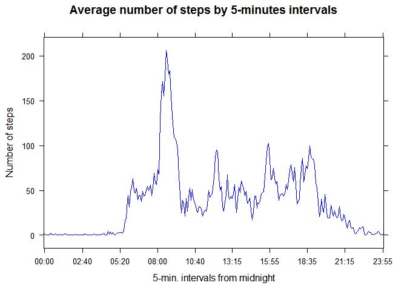
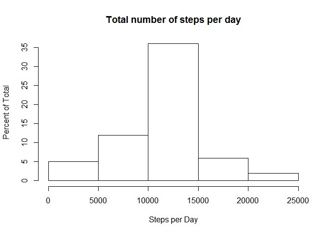
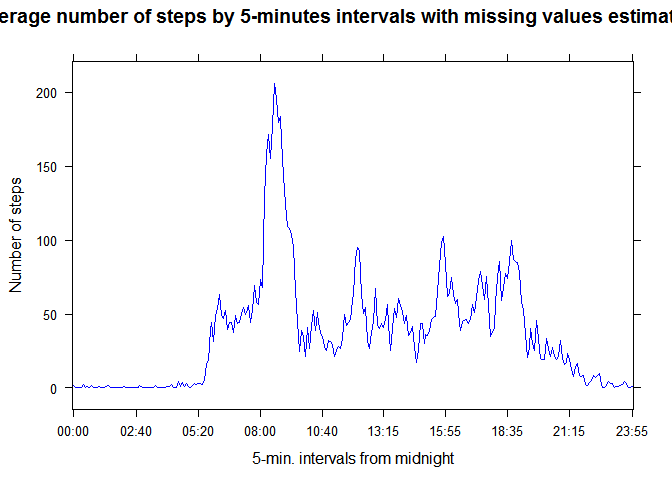
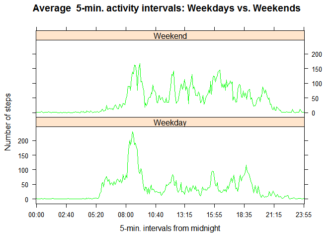

# Reproducible Research: Peer Assessment 1
This assignment makes use of data from a personal activity monitoring device. This device collects data at 5 minute intervals through out the day. The data consists of two months of data from an anonymous individual collected during the months of October and November, 2012 and include the number of steps taken in 5 minute intervals each day.

###Data

The data for this assignment can be downloaded from the course web site:

Dataset: [Activity monitoring data](https://d396qusza40orc.cloudfront.net/repdata%2Fdata%2Factivity.zip) [52K]
The variables included in this dataset are:

**steps**: Number of steps taking in a 5-minute interval (missing values are coded as NA)

**date**: The date on which the measurement was taken in YYYY-MM-DD format

**interval**: Identifier for the 5-minute interval in which measurement was taken

The dataset is stored in a comma-separated-value (CSV) file and there are a total of 17,568 observations in this dataset.

##Set Up Environment
load any libaries

```r
library(lattice)
```


##1. Loading and Preprocessing the Activity Data

###Get and load the data
This section gets and loads the required data

```r
# set the url path for the download 
fileUrl <- "https://d396qusza40orc.cloudfront.net/repdata%2Fdata%2Factivity.zip"

#set the working directory
setwd("~/R/RepData_PeerAssessment1")

# set up some working variables. These can be changed depending on your requirements
workingDir = getwd()
dataDir = "data"
zipFile = "data/activity.zip"

# create a data directory if one does not exist directory
if (!file.exists(dataDir)){
  dir.create(file.path(workingDir, dataDir))
}

# This setting is used to for https connections. Windows machine no curl installed
setInternet2(use = TRUE) #This needs to be set to support https. Could not use curl as not installed

# download into the data directory
download.file(fileUrl, zipFile, method = "auto")

# get the name of the first file in the zip archive
fileName = unzip(zipFile, list=TRUE)$Name[1]

# unzip the file to the data directory
unzip(zipFile, files=fileName, exdir=dataDir, overwrite=TRUE)

# create dataFile which is full path to the extracted file
dataFile = file.path(dataDir, fileName)

# load the csv in data frame
activityData <- read.csv(dataFile, as.is=TRUE)
```


###Check the dataset

Check the column names of the activity dataset


```r
names(activityData)
```

```
## [1] "steps"    "date"     "interval"
```

Check the structure of the activity dataset 

```r
str(activityData)
```

```
## 'data.frame':	17568 obs. of  3 variables:
##  $ steps   : int  NA NA NA NA NA NA NA NA NA NA ...
##  $ date    : chr  "2012-10-01" "2012-10-01" "2012-10-01" "2012-10-01" ...
##  $ interval: int  0 5 10 15 20 25 30 35 40 45 ...
```

###Preprocessing of the dataset

Set the date column to a date column from character string

```r
activityData$date <- as.Date(activityData$date)
```

Add a column for the time of day as a factor

```r
activityData$timeOfDay <- as.factor(sprintf("%02d:%02d", activityData$interval %/% 100, activityData$interval %% 100))
```


##2. What is mean total number of steps taken per day?
2.1 Make a histogram of the total number of steps taken each day

Aggregate the data into a table


```r
totalSteps<- aggregate(steps ~ date, data = activityData, sum, na.rm = TRUE)
```

Plot the data on a histogram

```r
hist(totalSteps$steps, breaks=5, main="Total number of steps per day", xlab="Steps per day")
```

 

2.2 Calculate and report the mean and median total number of steps taken per day
The mean activity data is:

```r
mean(totalSteps$steps)
```

```
## [1] 10766.19
```

The median value is:

```r
median(totalSteps$steps)
```

```
## [1] 10765
```

##3. What is the average daily activity pattern?

3.1. Make a time series plot (i.e. type = "l") of the 5-minute interval (x-axis) and the average number of steps taken, averaged across all days (y-axis)

First get the mean intervals

```r
meanIntervals <- aggregate(steps ~ timeOfDay, activityData, mean, na.rm=TRUE)
```

Plot the data

```r
#This piece of code is set the right number of timeOfDay intervals for the lattice plotting system
#Set the number of intervals
x.tick.number <- 10
#Get the point at which the intervals appen i.e the row numbers. Because this data is split into weekend and weekday data we divide by 2
at <- round(seq(1, nrow(meanIntervals), length.out=x.tick.number))
#Setup the labels definitions
labels <- c()
for (r in at)
{
  #convert from factor to get the correct time of day for label
  labels <- append(labels, lapply(meanIntervals[r, "timeOfDay"], as.character))
}

xyplot(steps ~ timeOfDay, meanIntervals, type="l", col = "blue",ylab="Number of steps", xlab="5-min. intervals from midnight", main="Average number of steps by 5-minutes intervals", scales=list(x=list(at=at, labels=unlist(labels))))
```

 

3.2. Which 5-minute interval, on average across all the days in the dataset, contains the maximum number of steps?

```r
maxActivtiyByInterval <- meanIntervals$timeOfDay[which.max(meanIntervals$steps)]
```

The highest activity is recorded at 08:35


##4. Imputing missing values
There are a number of days/intervals where there are missing values (coded as NA). The presence of missing days may introduce bias into some calculations or summaries of the data.

4.1. Calculate and report the total number of missing values in the dataset (i.e. the total number of rows with NAs)


```r
missingSteps <- sum(is.na(activityData$steps))
missingSteps
```

```
## [1] 2304
```

```r
missingDates <- sum(is.na(activityData$date))
missingDates
```

```
## [1] 0
```

```r
missingIntervals <- sum(is.na(activityData$interval))
missingIntervals
```

```
## [1] 0
```

The number total number of missing steps for the activity dataset is  2304 while the toal number for the date column is 0 and for intervals is 0

4.2. Devise a strategy for filling in all of the missing values in the dataset. The strategy does not need to be sophisticated. For example, you could use the mean/median for that day, or the mean for that 5-minute interval, etc.

The meanIntervals dataset sets the mean for the intervals per days, this will be used to populate the missing data. The structure of this datset is shown below
 

```r
str(meanIntervals) 
```

```
## 'data.frame':	288 obs. of  2 variables:
##  $ timeOfDay: Factor w/ 288 levels "00:00","00:05",..: 1 2 3 4 5 6 7 8 9 10 ...
##  $ steps    : num  1.717 0.3396 0.1321 0.1509 0.0755 ...
```

4.3. Create a new dataset that is equal to the original dataset but with the missing data filled in


```r
# Create missing values from our strategy mentioned above
cleanActivityData <- activityData

# apply the same function we used to calculte the mean
cleanActivityData$steps[is.na(cleanActivityData $steps)] <- tapply(activityData$steps, activityData$interval, mean, na.rm = TRUE) 


# check to see if the structures are the same or different
summary(cleanActivityData)
```

```
##      steps             date               interval        timeOfDay    
##  Min.   :  0.00   Min.   :2012-10-01   Min.   :   0.0   00:00  :   61  
##  1st Qu.:  0.00   1st Qu.:2012-10-16   1st Qu.: 588.8   00:05  :   61  
##  Median :  0.00   Median :2012-10-31   Median :1177.5   00:10  :   61  
##  Mean   : 37.38   Mean   :2012-10-31   Mean   :1177.5   00:15  :   61  
##  3rd Qu.: 27.00   3rd Qu.:2012-11-15   3rd Qu.:1766.2   00:20  :   61  
##  Max.   :806.00   Max.   :2012-11-30   Max.   :2355.0   00:25  :   61  
##                                                         (Other):17202
```

```r
summary(activityData)
```

```
##      steps             date               interval        timeOfDay    
##  Min.   :  0.00   Min.   :2012-10-01   Min.   :   0.0   00:00  :   61  
##  1st Qu.:  0.00   1st Qu.:2012-10-16   1st Qu.: 588.8   00:05  :   61  
##  Median :  0.00   Median :2012-10-31   Median :1177.5   00:10  :   61  
##  Mean   : 37.38   Mean   :2012-10-31   Mean   :1177.5   00:15  :   61  
##  3rd Qu.: 12.00   3rd Qu.:2012-11-15   3rd Qu.:1766.2   00:20  :   61  
##  Max.   :806.00   Max.   :2012-11-30   Max.   :2355.0   00:25  :   61  
##  NA's   :2304                                           (Other):17202
```

4.4. Make a histogram of the total number of steps taken each day and Calculate and report the mean and median total number of steps taken per day.


```r
totalStepsPerDay <- aggregate(steps ~ date, cleanActivityData, sum)

hist(totalStepsPerDay$steps, breaks=5, main="Total number of steps per day", xlab="Steps per Day", ylab="Percent of Total")
```

 


```r
mean(cleanActivityData$steps) #no need to remove NA as they are already removed
```

```
## [1] 37.3826
```

```r
median(cleanActivityData$steps) #no need to remove NA as they are already removed
```

```
## [1] 0
```

Do these values differ from the estimates from the first part of the assignment? 

**The shape of the histogram is generally unchanged. If we look at the mean and meadian values these are also fairly unchanged**

What is the impact of imputing missing data on the estimates of the total daily number of steps?

**The total number of steps has increased from the original value**

4.5. Make a time series plot (i.e. type = "l") of the 5-minute interval (x-axis) and the average number of steps taken, averaged across all days (y-axis)


```r
meanCleanInterval <- aggregate(steps ~ timeOfDay, cleanActivityData, mean)

#This piece of code is set the right number of timeOfDay intervals for the lattice plotting system
#Set the number of intervals
x.tick.number <- 10
#Get the point at which the intervals appen i.e the row numbers. Because this data is split into weekend and weekday data we divide by 2
at <- round(seq(1, nrow(meanCleanInterval), length.out=x.tick.number))
#Setup the labels definitions
labels <- c()
for (r in at)
{
  #convert from factor to get the correct time of day for label
  labels <- append(labels, lapply(meanCleanInterval[r, "timeOfDay"], as.character))
}

xyplot(steps ~ timeOfDay, meanCleanInterval, type="l", col = "blue", ylab="Number of steps", xlab="5-min. intervals from midnight", main="Average number of steps by 5-minutes intervals with missing values estimated", scales=list(x=list(at=at, labels=unlist(labels))))
```

 

##5. Are there differences in activity patterns between weekdays and weekends?

5.1. Create a new factor variable in the dataset with two levels - "weekday" and "weekend" indicating whether a given date is a weekday or weekend day.

Add a day column to our clean dataset

```r
cleanActivityData$day <- weekdays(cleanActivityData$date)
```

Add a day type (Weekday/Weekend) to our clean dataset

```r
cleanActivityData$dayType <- as.factor(ifelse(weekdays(cleanActivityData$date) %in% c("Saturday","Sunday"), "Weekend", "Weekday")) 
```

Check the data

```r
head(cleanActivityData)
```

```
##       steps       date interval timeOfDay    day dayType
## 1 1.7169811 2012-10-01        0     00:00 Monday Weekday
## 2 0.3396226 2012-10-01        5     00:05 Monday Weekday
## 3 0.1320755 2012-10-01       10     00:10 Monday Weekday
## 4 0.1509434 2012-10-01       15     00:15 Monday Weekday
## 5 0.0754717 2012-10-01       20     00:20 Monday Weekday
## 6 2.0943396 2012-10-01       25     00:25 Monday Weekday
```

5.2 Make a panel plot containing a time series plot (i.e. type = "l") of the 5-minute interval (x-axis) and the average number of steps taken, averaged across all weekday days or weekend days (y-axis). See the README file in the GitHub repository to see an example of what this plot should look like using simulated data.


```r
meanIntervalsByDayType <- aggregate(steps ~ timeOfDay + dayType, data=cleanActivityData, mean)

#This piece of code is set the right number of timeOfDay intervals for the lattice plotting system
#Set the number of intervals
x.tick.number <- 10
#Get the point at which the intervals appen i.e the row numbers. Because this data is split into weekend and weekday data we divide by 2
at <- round(seq(1, nrow(meanIntervalsByDayType)/2, length.out=x.tick.number))
#Setup the labels definitions
labels <- c()
for (r in at)
{
  #convert from factor to get the correct time of day for label
  labels <- append(labels, lapply(meanIntervalsByDayType[r, "timeOfDay"], as.character))
}
#Need to unlist the lables to a vector
xyplot(steps ~ timeOfDay | dayType, data=meanIntervalsByDayType, type="l", col="green", layout=c(1,2), ylab="Number of steps", xlab="5-min. intervals from midnight", main="Average  5-min. activity intervals: Weekdays vs. Weekends", scales=list(x=list(at=at, labels=unlist(labels)))) 
```

 
